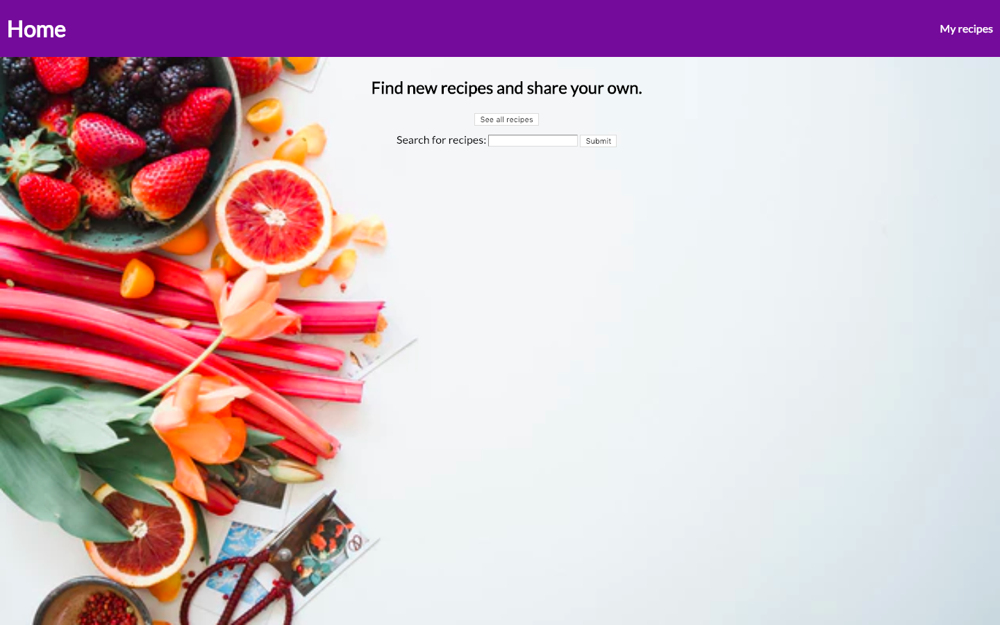
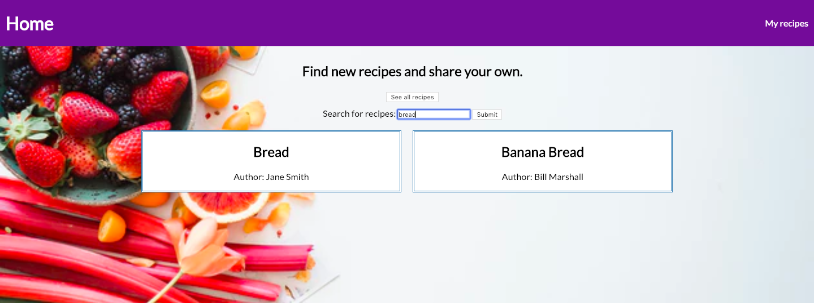
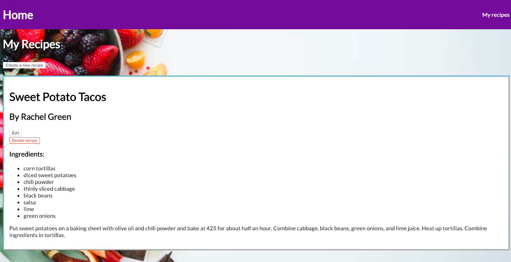
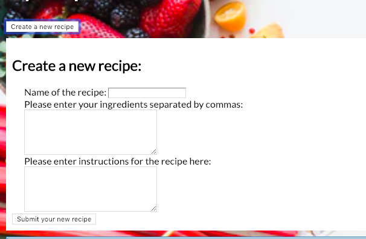

# The Right Recipe

<a href="https://quiet-savannah-23779.herokuapp.com/" target="_blank">Link to app on Heroku</a>

This app allows you to access a small database of recipes and add your own.  The user can search for recipes by name or see all the recipes in the database.  There is also a "My recipes" page where the user can create new recipes, edit them once they've been added, and delete them.  You can also add comments to existing recipes.  Right now, the app is set up from the viewpoint of a single user ("Rachel Green"), but in the future I may add login functionality so that there can be multiple users.

Screenshots: 

Home page: 

Search results: 

"My recipes" page: 

Form for creating a new recipe:

Recipe with comments: 

Technologies used: Node, Express, Mongodb/Mongoose, Travis CI, Heroku, JavaScript, HTML, CSS 

